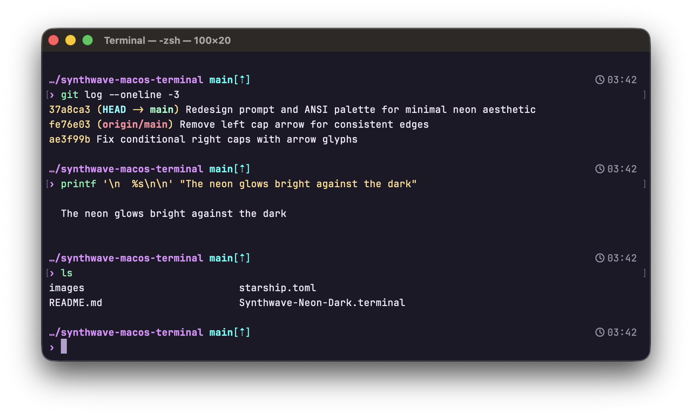

# Phosphor Neon Dark

A neon phosphor theme for macOS Terminal.app, [Ghostty](https://ghostty.org/), and [Starship](https://starship.rs).



## Contents

```
phosphor-terminal-theme/
├── Phosphor-Neon-Dark.terminal   macOS Terminal.app profile
├── ghostty.config                Ghostty theme fragment (colors, font, ANSI palette)
├── starship.toml                 Starship theme fragment (palette + prompt symbol)
└── images/                       screenshots
```

Each file is **theming only** — colors, font, palette, prompt glyph. No keybinds, behavior flags, or identity. Drop into your own config and layer your own preferences on top.

## Prompt colors

| Element             | Color          | Hex                                                              |
| ------------------- | -------------- | ---------------------------------------------------------------- |
| Directory           | Purple         |  `#e08fff`  |
| Git branch & status | Cyan           |  `#00fff5`  |
| Right-side context  | Gray           |  `#9595a8`  |
| Errors & sudo       | Red            |  `#ff4466`  |
| Default text        | Lavender white |  `#eee9f5`  |

## ANSI colors

| Color   | Normal                                                           | Bright                                                           |
| ------- | ---------------------------------------------------------------- | ---------------------------------------------------------------- |
| Black   |  `#262040`  |  `#6a6490`  |
| Red     |  `#ff4466`  |  `#ff7888`  |
| Green   |  `#5cffaa`  |  `#90ffc0`  |
| Yellow  |  `#ffd580`  |  `#ffe8a0`  |
| Blue    |  `#c89fff`  |  `#ddb4ff`  |
| Magenta |  `#ff6eb4`  |  `#ff9ed0`  |
| Cyan    |  `#00fff5`  |  `#70fffa`  |
| White   |  `#eee9f5`  |  `#ffffff`  |

## Window

| Element    | Hex                                                              | Notes        |
| ---------- | ---------------------------------------------------------------- | ------------ |
| Background |  `#14101f`  | 95% opacity  |
| Foreground |  `#eee9f5`  |              |
| Cursor     |  `#b49fd0`  |              |

## Install

```zsh
# 1. Install JetBrains Mono Nerd Font (used by Ghostty + Starship for icons)
brew install --cask font-jetbrains-mono-nerd-font
```

### Terminal.app

```zsh
open Phosphor-Neon-Dark.terminal
# Settings → Profiles → "Phosphor Neon Dark" → "Default"
```

### Ghostty

```zsh
# Either append directly to your config:
cat ghostty.config >> ~/.config/ghostty/config

# Or keep it modular by adding one line to your config:
# config-file = /absolute/path/to/ghostty.config
```

### Starship

```zsh
brew install starship

# Merge the palette + character blocks into your starship.toml.
# If you don't have one yet, you can start with these blocks as-is:
cat starship.toml >> ~/.config/starship.toml
```

The `[palettes.phosphor]` block defines named colors (`purple`, `cyan`, `red`, `gray`, `fg`) you can then reference in any module style — see the suggested assignments at the bottom of `starship.toml`.

## Companion projects

- [phosphor-zed-theme](https://github.com/eneko-codes/phosphor-zed-theme) — same colors, same vibe, for the Zed editor
